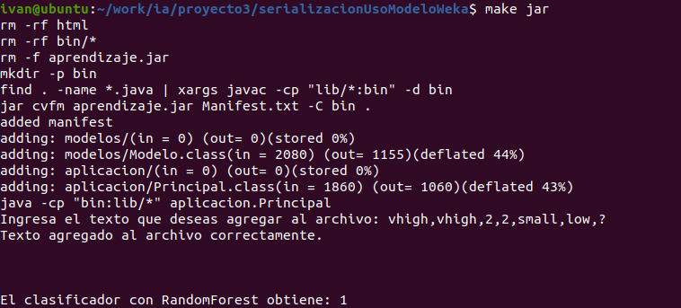
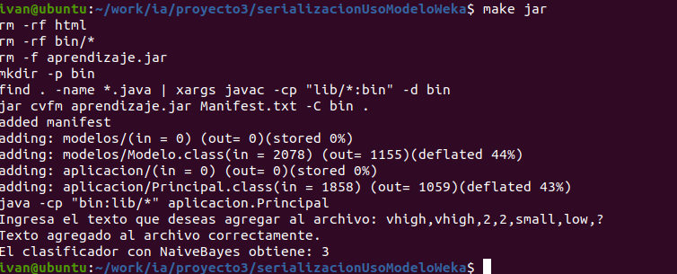
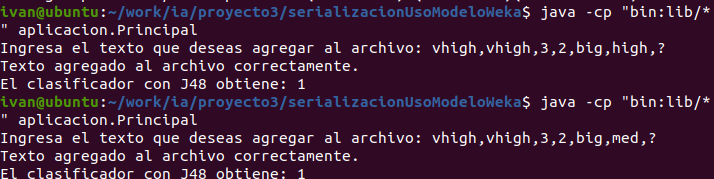

# Práctica III de Inteligencia Artificial.

### Objetivo de la práctica: 
Predicción de resultados a partir de datos preseleccionados suficientes como para aplicar algoritmos de aprendizaje automático.
### Miembros del equipo:
Raquel Cerezo, Tomás Machín e Iván Martínez

## 1/ Elección del problema:
###### Detección del modelo óptimo de coche para un cliente que busque unas características concretas del vehículo en base a unas necesidades específicas.

## 2/ Fuente de datos seleccionada:
Podrá acceder a los datos empleados en la práctica aquí: [Link a la fuente de datos](https://github.com/lpfgarcia/ucipp/blob/master/uci/car-evaluation.arff).

### 3/ Identificación de los atributos y características relevantes de los mismos:

*  buying       v-high, high, med, low
*  maint        v-high, high, med, low
*  doors        2, 3, 4, 5-more
*  persons      2, 4, more
*  lug_boot     small, med, big
*  safety       low, med, high

### 4/ Ubicación de los archivos .arff :

Al abrir la carpeta podrá consultar los datos siguiendo la siguiente ruta:
[serializacionUsoModeloWeka/training_data/car-evaluation.arff]().

Siguiendo la ruta que se le proporciona a continuación podrá acceder al archivo test:
[serializacionUsoModeloWeka/test_data/testCarEv.arff]().

### 5/ Algoritmos trabajados:

| Algoritmo  | Observaciones destacadas |
| ------------- |:-------------:|
| J48     | Con el modelo original de datos se encontraron errores en el balanceo de datos por lo que se tuvo que balancear el archivo.|
|   NaiveBayes    |  No se observaron muchos cambios con respecto al modelo anterior.  |
| Random Forest     | A modo de comprobación empleamos Random Forest para realizar comparaciones con respecto a los datos anteriormente obtenidos. |

> La ubicación de los objetos persistentes creados se encuentra en la siguiente carpeta:
>
>> [serializacionUsoModeloWeka/models]().

### Capturas de pantalla
* Descripción general de las capturas de pantalla (indicando cual pertenecea q ué algoritmo respectivamente): 
    * En la imagen se muestra la ejecución del programa, se ejecuta un escanner para que el usuario ingrese un dato entero a falta del último parámetro para consultarlo. A continuación, se añade al archivo de test lo escrito por el usuario, se consulta y devuelve el parámetro solicitado (atributo de clase coche). 
* Random Forest:
  
 
  
* NaiveBayes:
  
 
  
* J48:

  
### 7/ Implementación de la aplicación por consola en este caso:
~~~javascript
/*
* To change this license header, choose License Headers in Project Properties.
* To change this template file, choose Tools | Templates
* and open the template in the editor.
*/
package aplicacion;
import java.util.Scanner;
import modelos.Modelo;
import java.io.BufferedWriter;
import java.io.FileWriter;
import java.io.IOException;
public class Principal {
 
    public static void main(String[] args) {
        Modelo modelo = new Modelo();
        Scanner scanner = new Scanner(System.in);
        // Nombre del archivo
        String nombreArchivo = "./test_data/testCarEv.arff";
        // Pedir al usuario que ingrese texto
        System.out.print("Ingresa el texto que deseas agregar al archivo: ");
        String textoUsuario = scanner.nextLine();
 
        try {
            // FileWriter con true como segundo argumento para permitir la escritura al final del archivo
            FileWriter fileWriter = new FileWriter(nombreArchivo, true);
            // BufferedWriter para escribir eficientemente en el archivo
            BufferedWriter bufferedWriter = new BufferedWriter(fileWriter);
            // Escribir el texto en el archivo
            bufferedWriter.write(textoUsuario);
            bufferedWriter.newLine(); // Agregar nueva línea si es necesario
            // Cerrar el BufferedWriter
            bufferedWriter.close();
            System.out.println("Texto agregado al archivo correctamente.");
        } catch (IOException e) {
            System.err.println("Error al escribir en el archivo: " + e.getMessage());
        }
            // Aprende el modelo
            modelo.aprenderModelo();
            // Aplica el modelo y muestra la predicción
            System.out.println("El clasificador con RandomForest obtiene: " + modelo.aplicarModelo());

        scanner.close();
}
}
~~~
### Análisis de métricas relevantes:

* Análisis de la precisión: Se ha obtenido un valor del 25% de precisión tras haber probado con unos 30 datos, los cuales estaban balanceados, devolviendo siempre el mismo número, por lo que es de +-1/4.
*_Número de predicciones correctas / Número total predicciones_
* Análisis del recall: El cálculo realizado para su obtención ha sido de 25/(25+0)=1, por tanto, el valor del recall obtenido es 1.
* _recall= Verdaderos positivos/ (Verdaderos positivos + Falsos positivos_
* Análisis de F: 
_F = 2* precision * recall / (precision + recall)_
  F= 2* 1/4 * 1/(1/4+1)= 0.4
